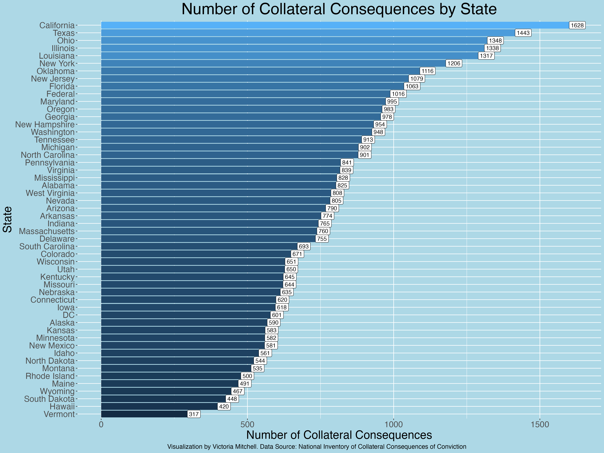
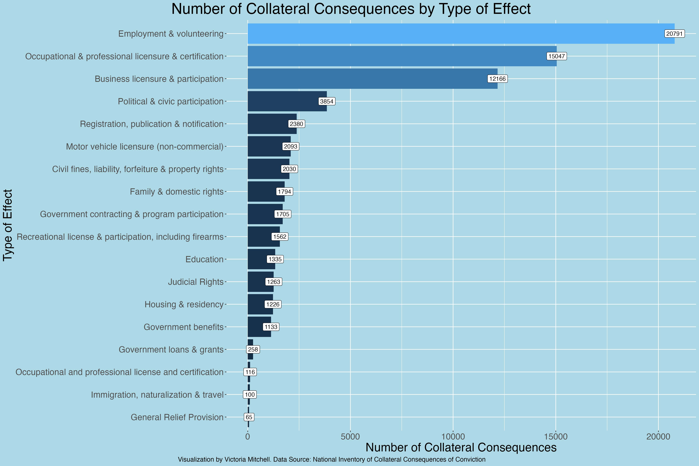
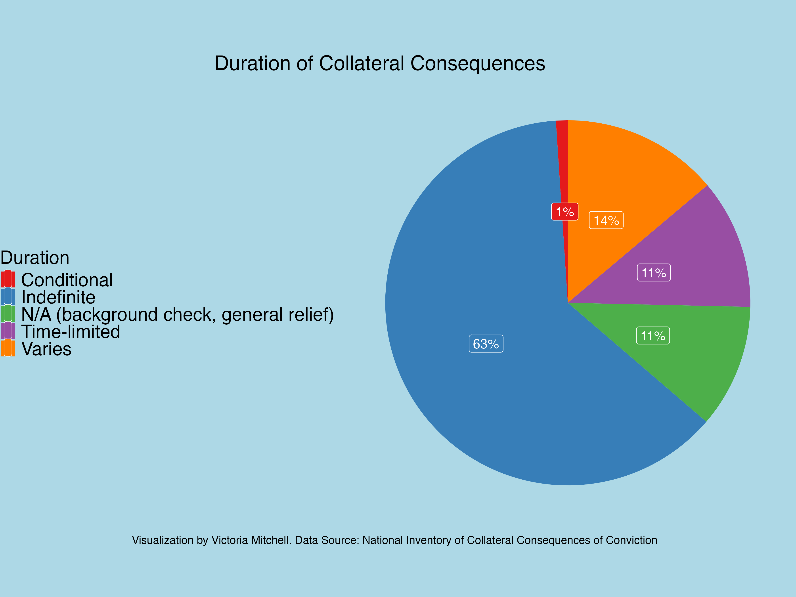
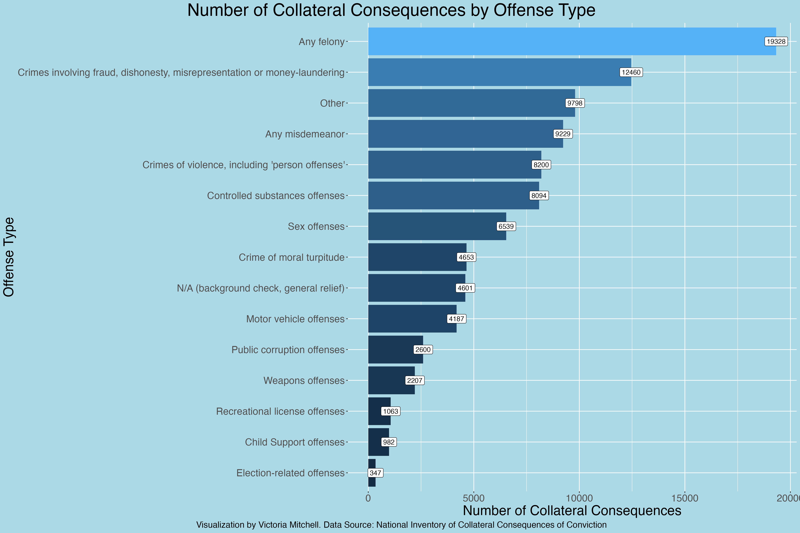

<html>
  <head></head>
  <body>
    <h1><a href = "./collateral_consequences.html">Collateral Consequences of Conviction</a></h1>
    <h4>Victoria Mitchell, 12/01/2024</h4>
    <h2>Analysis & Visualization of Data Exported From the National Inventory of Collateral Consequences of Conviction</h2>
    <h2>What Are Collateral Consequences of Conviction?</h2>
    
"Collateral consequences are legal disabilities imposed by law as a result of a criminal conviction regardless of whether a convicted individual serves any         time incarcerated. These consequences create social and economic barriers for individuals reentering into society by denying or restricting benefits otherwise       available to all Americans. Collateral consequences are known to adversely affect adoptions, housing, welfare, immigration, employment, professional                 licensure, property rights, mobility, and other opportunities—the collective effect of which increases recidivism and undermines meaningful reentry of the           convicted for a lifetime. Moreover, collateral consequences disproportionately affect minority and economically disadvantaged populations. Despite the               sweeping adverse consequences flowing from collateral consequences, defendants are generally not entitled, as a matter of due process, to be warned of these         consequences, either before accepting a plea or upon conviction. Although the U.S. Supreme Court has required consideration of certain immigration effects of         a criminal conviction, the Court left open what other disenfranchisements might rise to the level requiring constitutional protection... 60% of formerly             incarcerated individuals remain unemployed one year after their release... If they do not get work, their likelihood of recidivism increases... Federal               law...grants discretion to local housing authorities to deny housing based on any criminal activity...Private housing is not easy to come by either. Most           landlords use background and credit checks to screen out prospective tenants with criminal records.  It is no wonder, then, that nearly one-third of                 individuals released from incarceration expect to go to homeless shelters, which are more often than not unsafe. Obviously, lack of stable housing                   undoubtedly contributes to increased recidivism." (American Bar Association, 2018).

  
It's also important to note that: "The impact of these "collateral consequences" is often discussed in the context of re-entry, but they attach not only to felonies and incarcerated individuals but also to misdemeanors and individuals who have never been incarcerated. Collateral consequences tend to last indefinitely, long after an individual is fully rehabilitated... Relevant laws and regulations in the U.S. are notoriously difficult to track down and understand. As a result, attorneys and judges are not familiar with all of the collateral consequences triggered by certain crimes. They may not have the time or ability to find them and then determine whether they are applicable to a defendant.  Consequently, the people involved in criminal proceedings may not realize the full ramifications of being found guilty or pleading guilty to particular charges." (Berson, 2013)

    <h2>Just How Many Collateral Consequences of Conviction Are There?</h2>
    
To answer this question, I exported data from the National Inventory of Collateral Consequences of Conviction.  I obtained data for all 50 states, Washington, D.C., and federally enacted collateral consequences.  The sum of the "Number.of.Consequences" for all combined jurisdictions analyzed is 41,965.  These represent 41,965 laws and regulations that impact individual rights and place supreme hardship on the justice impacted, often indefinitely, long after a sentence has been served.

    
Below is a visualization of the number of collateral consequences of conviction by jurisdiction.

    
    <h2>What Kinds of Effects Do Collateral Consequences Have for the Justice Impacted?</h2>
    
This analysis revealed that of all collateral consequences of conviction, 50% of them affect employment & volunteering opportunities, 36% affect Occupational & professional licensure & certification opportunities, 29% affect business licensure & participation opportunities, 9% affect political & civic participation opportunities, 6% involve registration, publication & notification, 5% affect non-commercial motor vehicle licensure, 4% affect family & domestic rights, 4% affect government contracting & program participation, 4% affect recreational licenses & participation, including firearms, 3% affect Educational opportunities, 3% affect housing & residency opportunities, 2-3% affect government benefits eligibility, and less than 1% affect government loans and grants eligibility, and less than 1% affect immigration, naturalization, & travel.

While one may be tempted to think categories with lower percentages of all collateral consequences have smaller effects on individuals and society, it's important to understand the context of each specific statute and regulation regarding the effects, including the duration of time an individual is subject to these collateral consequences.

    
Below is a visualization of the number of collateral consequences of conviction that fall into each category.

    
    <h2>How Long Do Collateral Consequences of Conviction Impact an Individual?</h2>
    
Most collateral consequences can affect an individual indefinitely, making it difficult to overcome barriers for a lifetime. This analysis revealed that 63% of all collateral consequences of conviction in the U.S. can affect individuals indefinitely, 14% vary, only 11% are time-limited, 11% are categorized as "NA (background check, general relief)", and 1% are conditional.

    
Below is a visualization that breaks down the perfentage of all collateral consequences by length of time an individual can be subject to the consequence.

    
    <h2>What Types of Offenses Cause an Individual to Be Subject to Collateral Consequences of Conviction?</h2>
    
It's not only those with felony convictions, or those who have served prison sentences that are subject to collateral consequences of convictions.  Those with misdemeanor convictions, and even those who were never sentenced to jail or probation can face these effects.  Below is a visualization of the percent of all collateral consequences that apply to individuals convicted by offense type.

    
    <h2>Discussion</h2>
    
With the racial and socio-economic disparities rampant in the justice system and application of collateral consequences, as well as the logical and observed link between collateral consequences of conviction and recidivism, detailed in numerous studies and articles, and clearly acknowledged by the legal community by evidence of the excerpt from the ABA, it's important for our policymakers to reduce collateral consequences of conviction, and limit the durations of their effects.  Reducing and eliminating barriers for people to succeed would both increase opportunities for those disadvantaged, as well as increase public safety by reducing instances of recidivism, and contribute to reducing the effects of mass incarceration.  How can we not explore this as a relevant solution, though not all-encompassing, solution?

    <h2></h2>
    <h3>References:</h3>
    
American Bar Association. (2018). Collateral Consequences of Criminal Convictions: Judicial Bench Book. Office of Justice Programs' National Criminal Justice Reference Service. <a href = "www.ojp.gov/pdffiles1/nij/grants/251583.pdf">www.ojp.gov/pdffiles1/nij/grants/251583.pdf</a>

    
Berson, Sarah. (2013). Beyond the Sentence - Understanding Collateral Consequences. National Institute of Justice Journal, no. 272, Sept. 2013, pp. 24–29. <a href = "https://nij.ojp.gov/topics/articles/beyond-sentence-understanding-collateral-consequences">https://doi.org/https://nij.ojp.gov/nij-journal/nij-journal-issue-272</a>

  
National Inventory of Collateral Consequences of Conviction. (Accessed: Dec. 1st, 2024).  Bureau of Justice Assistance, Office of Justice Programs, U.S. Department of Justice, The National Reentry Resource Center, & The Council of State Governments Justice Center. <a href = "https://niccc.nationalreentryresourcecenter.org/consequences">https://niccc.nationalreentryresourcecenter.org/consequences</a>

  </body>
</html>
