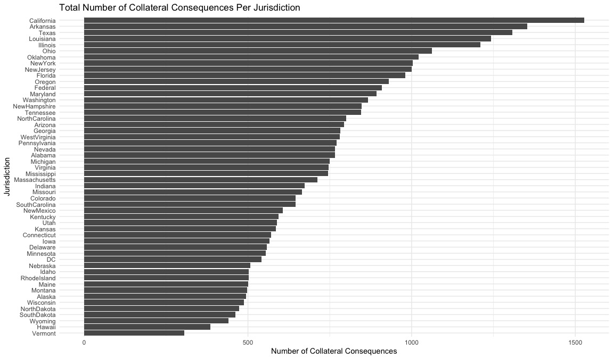
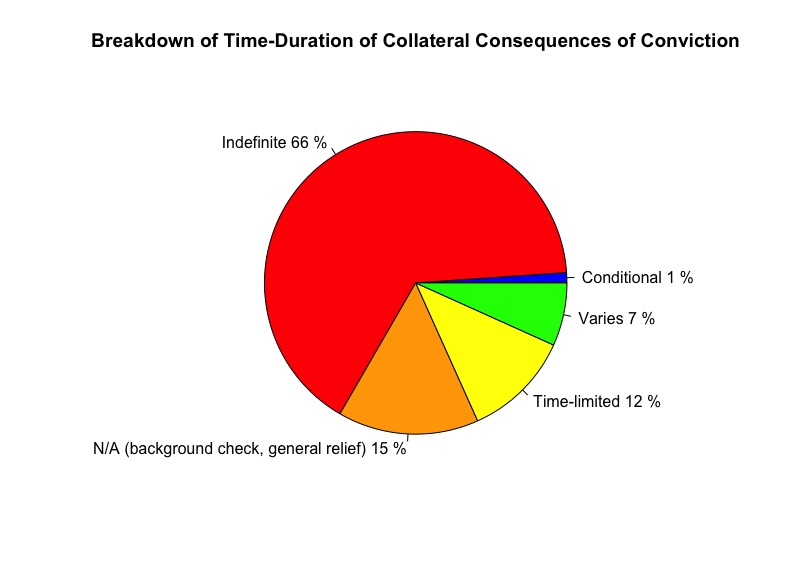

<!DOCTYPE html>
<html>
  <head></head>
  <body>
    <h1>Collateral Consequences of Conviction</h1>
    <h3>Victoria Mitchell, 12/01/2024</h3>
    <h2>Analysis & Visualization of Data Exported From the National Inventory of Collateral Consequences of Conviction</h2>
    <h2>What Are Collateral Consequences of Conviction?</h2>
    
"Collateral consequences are legal disabilities imposed by law as a result of a criminal conviction regardless of whether a convicted individual serves any         time incarcerated. These consequences create social and economic barriers for individuals reentering into society by denying or restricting benefits otherwise       available to all Americans. Collateral consequences are known to adversely affect adoptions, housing, welfare, immigration, employment, professional                 licensure, property rights, mobility, and other opportunities—the collective effect of which increases recidivism and undermines meaningful reentry of the           convicted for a lifetime. Moreover, collateral consequences disproportionately affect minority and economically disadvantaged populations. Despite the               sweeping adverse consequences flowing from collateral consequences, defendants are generally not entitled, as a matter of due process, to be warned of these         consequences, either before accepting a plea or upon conviction. Although the U.S. Supreme Court has required consideration of certain immigration effects of         a criminal conviction, the Court left open what other disenfranchisements might rise to the level requiring constitutional protection... 60% of formerly             incarcerated individuals remain unemployed one year after their release... If they do not get work, their likelihood of recidivism increases... Federal               law...grants discretion to local housing authorities to deny housing based on any criminal activity...Private housing is not easy to come by either. Most           landlords use background and credit checks to screen out prospective tenants with criminal records.  It is no wonder, then, that nearly one-third of                 individuals released from incarceration expect to go to homeless shelters, which are more often than not unsafe. Obviously, lack of stable housing                   undoubtedly contributes to increased recidivism." (American Bar Association, 2018).

  
It's also important to note that: "The impact of these "collateral consequences" is often discussed in the context of re-entry, but they attach not only to felonies and incarcerated individuals but also to misdemeanors and individuals who have never been incarcerated. Collateral consequences tend to last indefinitely, long after an individual is fully rehabilitated... Relevant laws and regulations in the U.S. are notoriously difficult to track down and understand. As a result, attorneys and judges are not familiar with all of the collateral consequences triggered by certain crimes. They may not have the time or ability to find them and then determine whether they are applicable to a defendant.  Consequently, the people involved in criminal proceedings may not realize the full ramifications of being found guilty or pleading guilty to particular charges." (Berson, 2013)

    <h2>Just How Many Collateral Consequences of Conviction Are There?</h2>
    
To answer this question, I exported data from the National Inventory of Collateral Consequences of Conviction.  I obtained data for all 50 states, Washington, D.C., and federally enacted collateral consequences.  The sum of entries in the data I obtained is 38,764.  These represent 38,764 laws and regulations that impact individual rights and place supreme hardship on the justice impacted, often indefinitely, long after a sentence has been served.

    <h2>Total Number of Collateral Consequences of Conviction by Jurisdiction (State, Federal, & D.C.)</h2>
    
    <h2>Breakdown of Time-Duration of Collateral Consequences of Conviction (Combined Jurisdictions)</h2>
    
    <h3>References:</h3>
    
American Bar Association. (2018). Collateral Consequences of Criminal Convictions: Judicial Bench Book. Office of Justice Programs' National Criminal Justice Reference Service. <a href = www.ojp.gov/pdffiles1/nij/grants/251583.pdf>www.ojp.gov/pdffiles1/nij/grants/251583.pdf</a>

    
Berson, Sarah. (2013). Beyond the Sentence - Understanding Collateral Consequences. National Institute of Justice Journal, no. 272, Sept. 2013, pp. 24–29. <a href = https://doi.org/https://nij.ojp.gov/nij-journal/nij-journal-issue-272>https://doi.org/https://nij.ojp.gov/nij-journal/nij-journal-issue-272</a>

  
National Inventory of Collateral Consequences of Conviction. (Accessed: Dec. 1st, 2024).  Bureau of Justice Assistance, Office of Justice Programs, U.S. Department of Justice, The National Reentry Resource Center, & The Council of State Governments Justice Center. <a href = https://niccc.nationalreentryresourcecenter.org/consequences >https://niccc.nationalreentryresourcecenter.org/consequences</a>

  </body>
</html>
